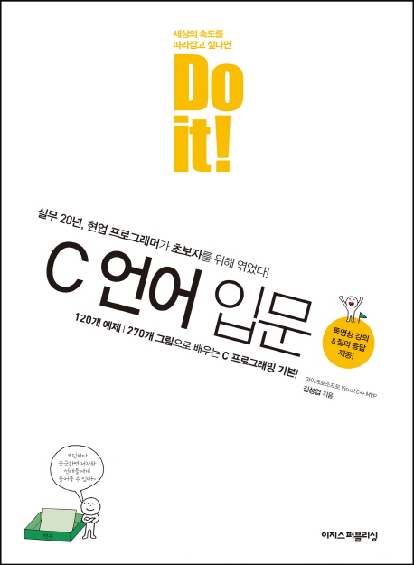

## About Me

* Born : 1998
* Nationality	: Republic of Korea
<!-- * Education	: null -->
<!-- * Job	: null -->

## My Development Environment

  

  

## Book is read finish.
|    |책의 제목|설명|
|----|----|----|
<!-- |책의 표지||| -->
|책 구매처 |테스트2|테스트3|
## Book is reading

## Reach me on

## GitHub Stats

 
