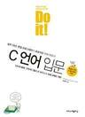
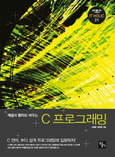

## Book is read finish.
|표지|책의 제목|ISBN|
|----|----|----|
||Do it! C언어 입문|9791187370703|
||개념과 원리로 배우는 C 프로그래밍|9788996567196|

ISBN이란?  
국제표준도서번호의 약자로 전세계에서 간행되는 **도서에게 주어지는 고유번호**이다.  
YES24나 교보문구에 **ISBN의 값을 복사 붙여넣기** 하면  책을 바로 찾을 수 있다.

