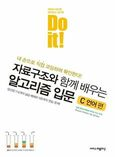
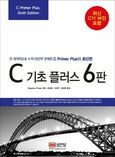
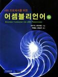
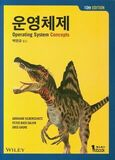
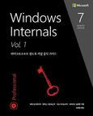

## Book is reading.
|표지|책의 제목|ISBN|
|----|----|----|
||Do it! 자료구조와 함께 배우는 알고리즘 입문 C 언어 편|9791188612130|
||C 기초 플러스 6판|9788931555318|
||X86 프로세서를 위한 어셈블리언어|9788996391920|
||운영체제|9791185475578|
||Windows Internals 7/e Vol.1|9791161750941|

ISBN이란?  
국제표준도서번호의 약자로 전세계에서 간행되는 **도서에게 주어지는 고유번호**이다.  
YES24나 교보문구에 **ISBN의 값을 복사 붙여넣기** 하면  책을 바로 찾을 수 있다.

